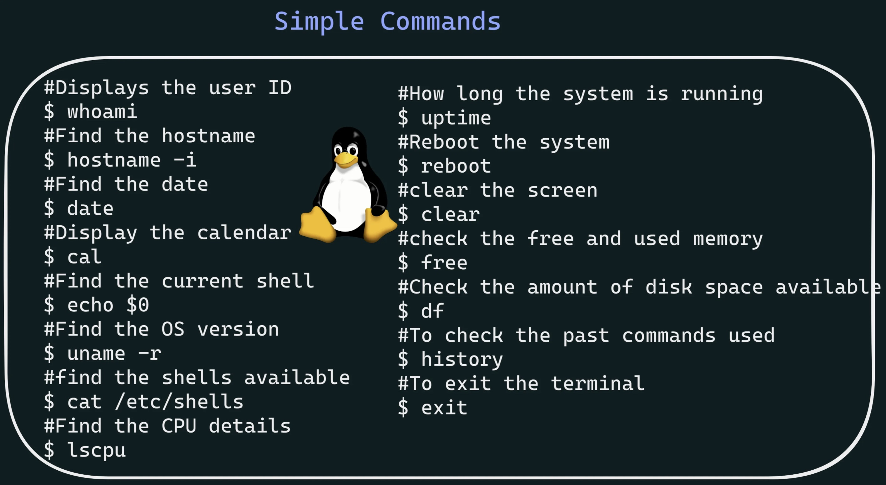

# Bash Overview

## Simple commands

|Code|Functionality
|:---:|:---:|
|```$ whoami```|Displays the user ID |
|```$ hostname -i ```|#Find the hostname|
|```$ date```|find the date|
|```$ cal```|Display the calendar|
|```$ echo $0```|Find the shell|
|```$ uname -r ```|Find the OS version|
|```$ cat /etc/shells```|find the shells available|
|```$ lscpu ```|Find the CPU details|
|```$ uptime```|How long the system is running|
|```$ rebbot```|Reboot the system|
|```$ clear ```|clear the screen|
|```$ free```|check the free and used memory|
|```$ df```|Check the amount of diskspace available|
|```$ history```|To check the past commands used|
|```$ exit```|To exit the terminal|


