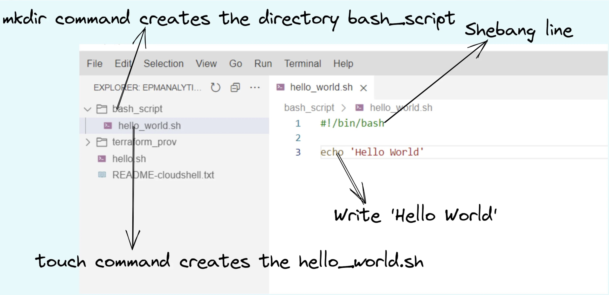
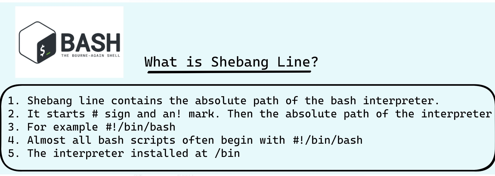
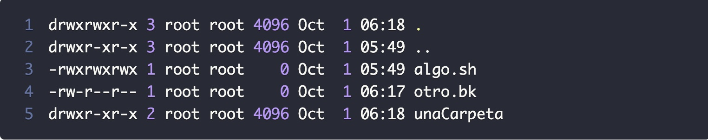

# My first script-Hello World:

## Steps:
* Create a directory bash_script:  
```mkdir bash_script```

* Create a file hello_world.sh:  
```touch hello_script.sh```

* Open the file:  
```hello_script.sh```

* Enter the shebang line:  
```#!/bin/bash```

* Enter the command:  
```echo ‘Hello World’```

* Save the file
* Open the terminal
* Check execution rights:  
```ls -la```

* Before executing make the file executable:  
```chmod +x hello_world.sh```

* Execute the file:  
```./hello_world.sh```





# What is Shebang Line?



# Linux permissions
```ls -la```



|Code|Functionality
|:---:|:---:|
|```r``` | ```R```ead permission on this file or directory.|
|```w``` | ```W```rite permission on this file or directory.|
|```x``` | e```X```ecution permission on this file or directory.
|```-```|The dash indicates the absence of that permission.|

As you will see, there are 10 characters that we see in this combination

|Code|Functionality
|:---:|:---:|
|The first | Indicates the type. If it is a file it will show us a dash and if it is a directory it will show us a d.|
|The following 3 | Corresponds to the permissions granted to the owner of this file
|Positions 5, 6 and 7 | Indicates the permissions that the group has.
|The last 3 characters |Tell us what permissions others have.|


|Code|Functionality|
|:---:|:---:|
|```d``` | This is a directory|
|```rwx``` | The owner has read, write and execute permissions (7)|
|```r-x``` | The group has read and execute permissions, but NOT write (5)|
|```r-x``` | Others have permission to read and execute, but NOT write (5)|