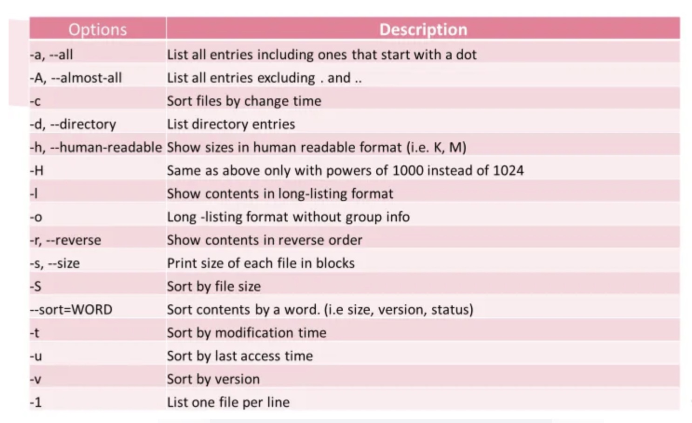
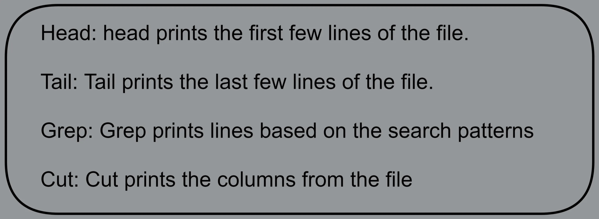

# File Management:


## 1. To display all the files-use ls
> ```ls [option] file_name```

|Functionallity|Code|
|:---:|:---:|
|To view the hidden files| ```ls -a```|
|To view the files in reverse order|```ls -r```|
|To display the last 10 recently modified files (l-long listing format, t-sorted by time and head-select the first 10 records)|```ls -lt \| head```|
|To display the files sorted by file size|``` ls -l -S```|


## The options available for ```ls``` are:



## 2. Create/Remove a directory:

```mkdir [options][directory_name]```

Creates a folder called my_directory
>```mkdir my_directory```

Removes the folder called my_directory
>```rmdir [option] [directory_name]```


## 3. Create/Remove a File:
Create a file-use touch
> ```touch [option] [file_name(s)]```

>```touch my_file.txt```
>```touch file1.txt file2.txt```

Remove the file
>```rm [options] [file_name(s)]```

>```rm my_file.txt```

Multiple files at once
>```rm file1.txt file2.txt```


4. To display the content of the file:


Head & Tails: To display the first few lines or last few lines of the file then use head or tail.The option -n sets the number of lines to be printed.

> ```head -n5 adult_t.csv```

> ```tail -n5 adult_t.csv```


CAT

To display the content of the file use cat command
>```cat [option] [file_name(s)]```

>```cat my_file.txt```

>```cat census_data.csv```


Concatenate the files to one file 
> ```cat file1 file2 file3 > file_all```

Concatenate the files to a pipe command
>```cat file1 file2 file3 | grep error```

Print the contents of the file
>```cat my_file.txt```

Output to a file again
>```cat file1 file2 file3 | grep error | cat > error_file.txt```

Append to the end
>```cat file1 file2 file3 | grep error | cat >> error_file.txt```

Also read from the input
>```cat < my_file.txt```

Is same like
>```cat my_file.txt```


TAC: 

Tac is the exact opposite of CAT and it just reverses the order. Please check the below screenshot for details.

>```tac my_file.txt```

Less: 

If the text file is large then instead of using cat, you can use less. Less shows a page at a time whereas in CAT the whole file is loaded. It is better to use less if the file size is large.

>```less my_file.txt```

Grep:

GREP stands for ```“global regular expression print”```.

Grep is used to search for specific patterns in a file or program output.

Grep is a powerful command and is used heavily. Please check the below examples

> ```grep [option(s)] pattern [file(s)]```

Search any line that contains the word 
> ```grep 'word' filename```

Search for the whole word
> ```grep -w "Masters" adult_t.csv```

Perform a case-insensitive search for the word ‘doctorate’ 
>```grep -i 'doctorate' adult_t.csv```

Look for all files in the current directory and in all of its subdirectories 
>```grep -R 'Error'```

Search and display the total number of times that the string ‘doctorate’ appears in a file adult_t.csv:
>```grep -c 'Doctorate' adult_t.csv```

Search for 2 words, then use egrep
>```egrep -w 'Male|Doctorate' adult_t.csv```

Search for a word in more than one file
> ```grep California f1.txt f2.txt f3.txt```


## 5. Move files:
>```mv [options] [source] [destination]```

>```mv hello_world.sh hello_world1.sh```


Move single file
>```mv my_file.txt /tmp```

Move multiple files
>```mv file1 file2 file3 /tmp```

You can also move a directory or multiple directories
>```mv d1 d2 d3 /tmp```

Also you can rename the file using move command
>```mv my_file1.txt my_file_newname.txt```


## 6. Copy Files:

> ```cp SOURCE_FILE DESTINATION_FILE``` \
```cp SOURCE_FILE DIRECTORY``` \
```cp [OPTION] SOURCE_FILE DESTINATION_FILE``` \
```cp [OPTION] SOURCE_FILE DIRECTORY_FILE```


Copy my_file.txt from /path/to/source/ to /path/to/target/folder/
>```cp /path/to/source/my_file.txt /path/to/target/folder/```

Copy my_file.txt from /path/to/source/ to /path/to/target/folder/ into a file called my_target.txt
>```cp /path/to/source/my_file.txt/path/to/target/folder/my_target.txt```

Copy my_folder to target_folder
>```cp -r /path/to/my_folder /path/to/target_folder```

Copy multiple directories- directories d1,d2 and d3 are copied to tmp.
>```cp -r d1 d2 d3 /tmp```


## 7. Gzip/Tar:

> ```gzip sorted_list.csv```\
```tar -cf user_names.tar user_names.txt```

For tar file, you need to give the options.Please check the documentation for the options.```


## 8. Locate and Find:
The ```find``` command is used to find files or directories in real-time. It is slow compared to ```locate```.

Locate is much faster. Locate is not real-time. Locate scans in a pre-build database and not in real-time. Locate is used to find the locations of files and directories.

If locate command is not available then you need to install it before using it. Check your Linux distribution and install it

It searches for a pattern for example search for *.sh files in the current directory.

>```find [path...] [expression]```

>#f: a regular file\
#d: directory\
#l: symbolic link\
#c: character devices\
#b: block devices\
#p: named pipe (FIFO)\
#s: socket

>find *.sh


Find by name
>```find . -name “my_file.csv"```

Wildcard search
>```find . -name "*.jpg"```

Find all the files in a folder
>```find /temp```

Search only files
>```find /temp -type f```

Search only directories
>```find /temp -type d```

Find file modified in last 3 hours
>```find . -mmin -180```

Find files modified in last 2 days
>```find . -mtime -2```

Find files not modified in last 2 days
>```find . -mtime +2```

Find the file by size
>```find -type f -size +10M```


## 9. Split a File: If you have a large file then you might have a requirement to split the larger file into smaller chunks. For splitting the file, you can use

Running the split command without any options will split a file into 1 or more separate files containing up to 1000 lines each.The files created with names xaa, xab, xac, etc.

> ```split my_file```

To change the prefix, add your desired prefix to the end of the command line

> ```split my_file my_prefix```

The default split is 1000 lines. if you want to use a custom one, then use the below.

>```split --lines=5000 my_file```

Also you can specify the file size

>```split --bytes=10 MB my_file```

