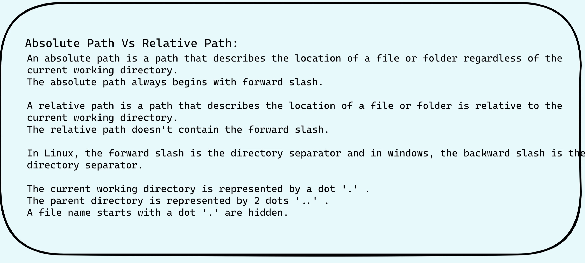

# File Management:



## 1. To display all the files-use ls
> ```ls [option] file_name```

|Functionallity|Code|
|:---:|:---:|
|To view the hidden files| ```ls -a```|
|To view the files in reverse order|```ls -r```|


* To display the last 10 recently modified files: 
- l-long listing format, 
- t-sorted by time, 
- and head-select the first 10 records.